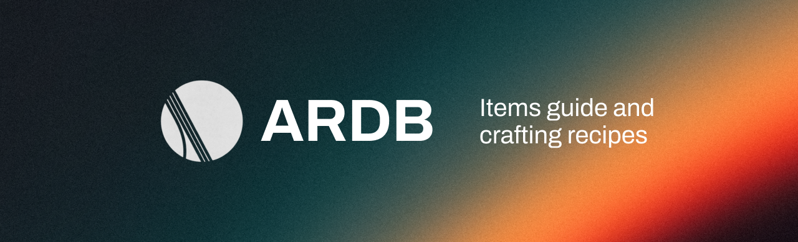

<div align="center">
  

  # Arc Raiders Database

  ### Complete Item Database & Crafting Guide for Arc Raiders

  [](https://arcraidersdatabase.com)
  [](https://nextjs.org/)
  [](https://www.typescriptlang.org/)
  [](https://tailwindcss.com/)
  [](https://creativecommons.org/licenses/by-nc-nd/4.0/)
  [](https://vercel.com)

  [Visit Website](https://arcraidersdatabase.com) • [Report Bug](https://github.com/Teyk0o/ARDB/issues) • [Request Feature](https://github.com/Teyk0o/ARDB/issues)

</div>

---

## About

**Arc Raiders Database** is a comprehensive, fan-made web application providing detailed information about all items in Arc Raiders. Explore 485+ items with full statistics, crafting recipes, recycling guides, and more.

### Features

- **Advanced Search & Filtering** - Find items by name, type, or rarity
- **Detailed Statistics** - Complete stat blocks for every item
- **Crafting Recipes** - Full crafting and recycling information
- **Recycling System** - Discover which items can be recycled to obtain others
- **Multilingual Support** - Available in 18 languages (EN, FR, DE, ES, PT, PL, NO, DA, IT, RU, JA, ZH-TW, UK, ZH-CN, KR, TR, HR, SR)
- **Responsive Design** - Optimized for desktop, tablet, and mobile
- **Authentic Design** - Follows Arc Raiders brand guidelines
- **Lightning Fast** - Built with Next.js 16 and optimized performance

---

## Quick Start

### Prerequisites

- Node.js 18.x or higher
- npm or yarn

### Installation

1. **Clone the repository**
   ```bash
   git clone https://github.com/Teyk0o/ARDB.git
   cd ARDB
   ```

2. **Install dependencies**
   ```bash
   npm install
   # or
   yarn install
   ```

3. **Run the development server**
   ```bash
   npm run dev
   # or
   yarn dev
   ```

4. **Open your browser**
   ```
   http://localhost:3000
   ```

---

## Tech Stack

- **Framework:** [Next.js 16](https://nextjs.org/) (App Router)
- **Language:** [TypeScript](https://www.typescriptlang.org/)
- **Styling:** [Tailwind CSS](https://tailwindcss.com/)
- **Font:** [Barlow](https://fonts.google.com/specimen/Barlow) (Official Arc Raiders font)
- **Deployment:** [Vercel](https://vercel.com)
- **Data Source:** [RaidTheory/arcraiders-data](https://github.com/RaidTheory/arcraiders-data)

---

## Project Structure

```
ARDB/
├── app/
│   ├── icon.png              # Favicon
│   ├── layout.tsx            # Root layout with SEO metadata
│   ├── page.tsx              # Home page
│   ├── globals.css           # Global styles
│   └── sitemap.ts            # Dynamic sitemap
├── components/
│   ├── ItemsPage.tsx         # Main items page component
│   ├── ItemCard.tsx          # Individual item card
│   ├── ItemDetailModal.tsx   # Item detail modal
│   └── CustomSelect.tsx      # Custom dropdown component
├── lib/
│   └── translations.ts       # i18n translations
├── types/
│   └── item.ts               # TypeScript interfaces
├── data/
│   └── items.json            # Complete items dataset (485+ items)
├── public/
│   ├── banner.png            # Repository banner
│   ├── favicon.png           # Favicon
│   └── ARC_Raider_Stacked_White_Color.png  # Arc Raiders logo
└── README.md
```

---

## Design System

The project follows the official Arc Raiders brand guidelines:

| Element | Value |
|---------|-------|
| **Primary Color** | `#f1aa1c` (Arc Yellow) |
| **Background** | `#130918` (Deep Blue) |
| **Secondary BG** | `#1a1120` (Arc Blue Light) |
| **Text** | `#ece2d0` (Off White) |
| **Font** | Barlow (400, 500, 700) |

---

## Data & Internationalization

### Data Source

This project uses data from the [RaidTheory/arcraiders-data](https://github.com/RaidTheory/arcraiders-data) repository:

- **Complete Item Database** - 485+ items with full stats and recipes
- **Daily Synchronization** - Data updates aligned with game patches
- **Community-Driven** - Maintained by the Arc Raiders community

The application uses a local JSON file (`data/items.json`) for optimal performance and offline access.

### Language Support

The database supports **18 languages** thanks to the RaidTheory community data project:

| Language | Code | Status |
|----------|------|--------|
| English | `en` | Complete |
| French | `fr` | Complete |
| German | `de` | Complete |
| Spanish | `es` | Complete |
| Portuguese | `pt` | Complete |
| Polish | `pl` | Complete |
| Norwegian | `no` | Complete |
| Danish | `da` | Complete |
| Italian | `it` | Complete |
| Russian | `ru` | Complete |
| Japanese | `ja` | Complete |
| Traditional Chinese | `zh-TW` | Complete |
| Ukrainian | `uk` | Complete |
| Simplified Chinese | `zh-CN` | Complete |
| Korean | `kr` | Complete |
| Turkish | `tr` | Complete |
| Croatian | `hr` | Complete |
| Serbian | `sr` | Complete |

Users can switch languages in real-time using the language selector in the top navigation bar. Language preference is saved to local storage for a consistent experience across visits.

---

## Contributing

Contributions are welcome! Here's how you can help:

1. **Fork the repository**
2. **Create a feature branch**
   ```bash
   git checkout -b feat/amazing-feature
   ```
3. **Commit your changes** (follow [Conventional Commits](https://www.conventionalcommits.org/))
   ```bash
   git commit -m "feat: add amazing feature"
   ```
4. **Push to the branch**
   ```bash
   git push origin feat/amazing-feature
   ```
5. **Open a Pull Request**

### Commit Convention

We follow [Conventional Commits](https://www.conventionalcommits.org/):

- `feat:` - New features
- `fix:` - Bug fixes
- `docs:` - Documentation changes
- `style:` - Code style changes (formatting, etc.)
- `refactor:` - Code refactoring
- `test:` - Adding or updating tests
- `chore:` - Maintenance tasks

---

## License

This project is licensed under the **Creative Commons Attribution-NonCommercial-NoDerivatives 4.0 International License** ([CC BY-NC-ND 4.0](https://creativecommons.org/licenses/by-nc-nd/4.0/)).

### What this means:

- **You can:** View, fork, and contribute to the code
- **You cannot:** Use this project for commercial purposes
- **You cannot:** Redistribute or redeploy modified versions
- **You must:** Give appropriate credit to the original author

For the full license text, see [LICENSE](LICENSE).

---

## Legal Disclaimer

This is a **fan-made project** and is **not affiliated with, endorsed by, or associated with Embark Studios or Nexon**.

- **Arc Raiders** is a trademark of Embark Studios and Nexon
- All game content, assets, and materials are property of their respective owners
- This project is for educational and informational purposes only

---

## Author

**Théo (Teyk0o)**

- GitHub: [@Teyk0o](https://github.com/Teyk0o)
- Website: [arcraidersdatabase.com](https://arcraidersdatabase.com)

---

## Acknowledgments

- **Embark Studios** - For creating Arc Raiders
- **Metaforge** - For providing the API
- **Arc Raiders Community** - For feedback and support
- **Next.js Team** - For the amazing framework

---

## Project Status

- Complete item database (485+ items)
- Crafting & recycling system
- Multilingual support (18 languages)
- Responsive design
- SEO optimization
- Continuous updates with game patches
- Community-driven translations

---

<div align="center">

  ### Star this repository if you find it useful!

  Made by the Arc Raiders community

  [Report an Issue](https://github.com/Teyk0o/ARDB/issues) • [Request a Feature](https://github.com/Teyk0o/ARDB/issues) • [Contribute](https://github.com/Teyk0o/ARDB/pulls)

</div>
